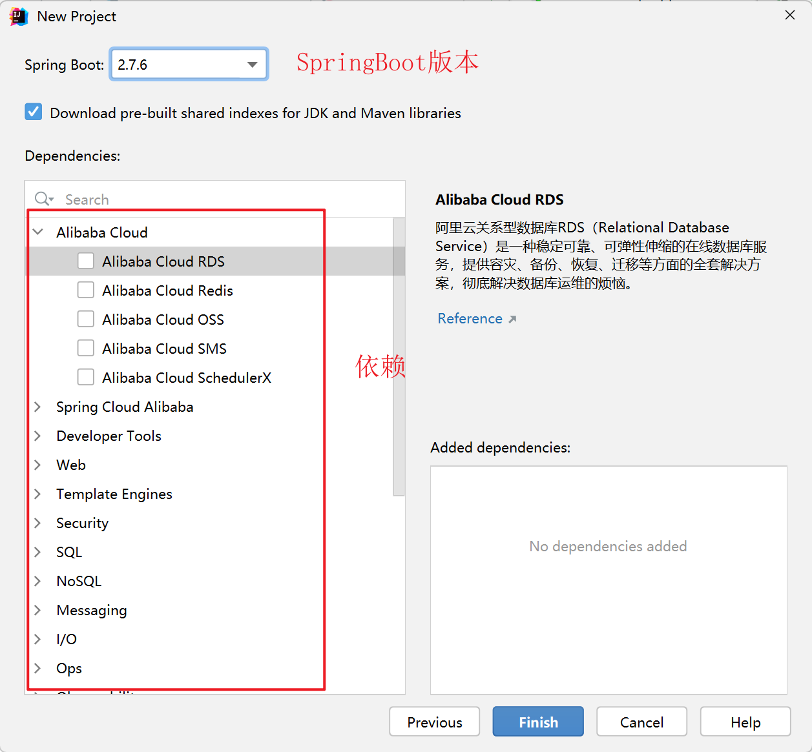

# SpringBoot项目初始化

## 1.创建git仓库

## 2.git clone将git项目拉取到本地

## 3.创建SpringBoot项目

至此，简单的SpringBoot项目创建完毕。

## 4.启动项目

项目创建完成后，基本结构如下（`不一定要完全相同，只要有XXXXApplication.java即可`）

接下来，找到XXXXApplication.java中的main方法，右键run即可启动

然后，通过浏览器访问`localhost:8080`

注意：有可能会出现如下情况--------`启动后立马就停止了`

> 其实，导致这种现象的原因是：缺少一个依赖，只需要在pom.xml中添加即可

然后重新构建maven，再启动